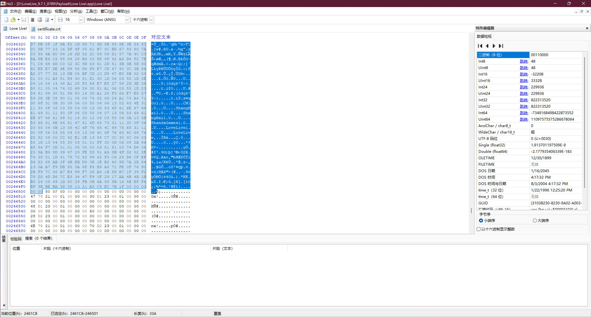
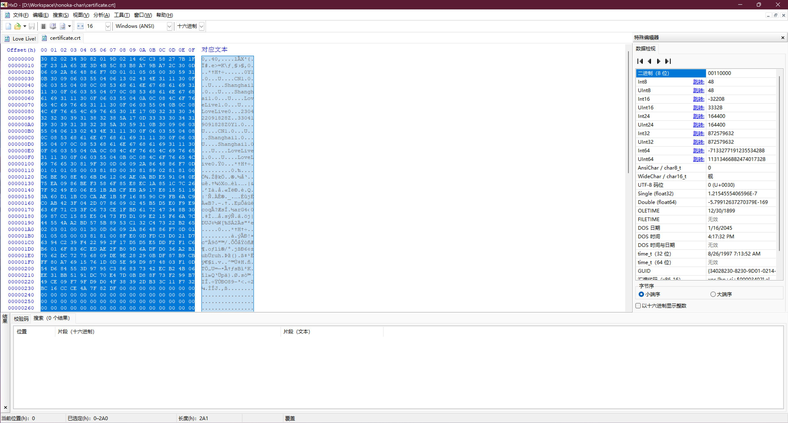
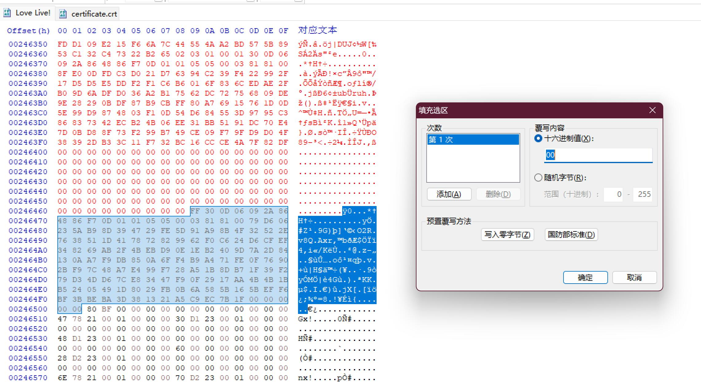

## 其二：SIF 客户端修改

SIF 客户端修改分为 Android 和 iOS 两个平台。

### 生成 RSA 密钥对

本程序已提供了一对 RSA 密钥，如果有需要自己生成的话，可以直接调用程序中的 `encrypt/rsa.go` 中的 `RSA_Gen` 函数生成，注意长度要用 1024。官方用的是 1024，太长的话 iOS 客户端进行 Hex 替换的时候会被截断。

### 生成 apk 签名用的 keystore

使用命令 `keytool -genkeypair -v -keystore sifkey.keystore -alias sifkey -keyalg RSA -keysize 2048 -validity 36500` 生成 keystore，密码自己设置，其他信息可以都默认回车即可。

生成的 `sifkey.keystore` 就是我们需要的。

### SIF 客户端修改（Android）

因为盛趣在原有日服客户端基础上，外面又套了一层自家的账号验证接口（手机号登录之类的）。所以客户端修改分为三个部分：
1. 盛趣相关接口地址的替换
2. 客户端公钥的替换
3. 客户端请求接口的替换

#### 盛趣相关接口地址的替换

使用 Apktool 反编译 apk 后，在 smali 代码里搜索 `sdo.com` 关键字，将地址替换成服务器的 IP 地址或者域名。

参考修改：https://github.com/YumeMichi/llsif-cn-client/commit/c8dba0c2ad5d274f5d0d8e346808a1b006d137ba

注意：使用 sed 替换可能会导致重新打包后的 apk 文件无法使用，暂时不知道是什么原因，可能需要手动改过去。

#### 客户端公钥的替换

原本这步是应该替换 so 库里的公钥的，但是因为 SIF 有好几个不同架构的库你可能都要改一遍，所以还是直接在 Java 代码里写死吧嗯~ o(*￣▽￣*)o

参考修改：https://github.com/YumeMichi/llsif-cn-client/commit/4b36dd48b26467b4dd1e1f479540645788c58f9a

#### 客户端请求接口的替换

SIF 的接口地址是写在数据包里，数据包又是经过加密。

1. 在 Apktool 解包目录下找到 `assets/AppAssets.zip`，解压到临时目录中
2. 使用 [honky-py](https://github.com/DarkEnergyProcessor/honky-py)  将解压出来的 `config/server_info.json` 解密出来
3. 修改解密后的 `server_info.json`，将其中的 `prod.game1.ll.sdo.com` 替换成服务器 IP 或者域名
4. 使用 [honky-py](https://github.com/DarkEnergyProcessor/honky-py) 将修改后的 `server_info.json` 重新加密
5. 将解压后的文件重新打包为 `assets/AppAssets.zip`
6. 更新 `assets/version` 文件中的 MD5 值

修改完最后通过 Apktool 重新打包成 apk 文件，然后使用 `apksigner sign --ks sifkey.keystore --ks-key-alias sifkey --out signed.apk unsigned.apk` 签名，使用前面生成的 keystore。

### SIF 客户端修改（iOS）

iOS 客户端需要替换的东西跟 Android 客户端差不多，只不过位置不一样以及修改方式不一样。包含以下几个部分：
1. 盛趣相关接口地址的替换
2. 客户端公钥和证书的替换
3. 客户端请求接口的替换

#### 盛趣相关接口地址的替换

先将 ipa 文件作为 zip 解压，进入 `Payload\Love Live!.app` 目录，找到 `Frameworks\ghome_sdk.framework\ghome_sdk` 文件，拖入 HxD Hex Editor。

搜索 `mgame.sdo.com`，替换成服务器 IP 或者域名。***这里有个坑，替换的 IP 或者域名长度必须和原来的一致，短了填 0 直接炸。不知道什么原因~***

#### 客户端公钥和证书的替换

在 Android 客户端中，盛趣接口通信所使用的 RSA 公钥是通过 `/basic/publickey` 接口获取的，在 iOS 客户端中则是写死的，这也是为什么前文生成 RSA 密钥对的时候要使用 1024 长度的原因。

由于 iOS 客户端使用的都是 RSA 公钥证书，不是 Android 客户端中使用的 RSA 普通公钥，所以需要使用 RSA 私钥生成一个 RSA 公钥证书文件和相应的 base64。

使用的命令如下：
```bash
openssl req -new -x509 -key privatekey.pem -sha1 -out ca.crt -days 36500 # 信息可以填一下或者全部回车
openssl req -new -key privatekey.pem -sha1 -out server.csr # 同上
openssl x509 -req -days 36500 -in server.csr -CA ca.crt -CAkey privatekey.pem -CAcreateserial -sha1 -out server.crt
```

其中 `server.crt` 就是需要的文件。打开可以发现里面也是一串 bas64。删掉头尾的 `-----BEGIN CERTIFICATE-----` 和 `-----END CERTIFICATE-----` 仅保留中间的 base64 部分，将回车符号去掉后备用。

回来继续修改上文中的 `ghome_sdk` 文件，就在上文搜索的 `handshake` 接口下面就是写死的盛趣接口通信用的公钥证书的 base64，长度有十六进制 384（也就是十进制 900）。使用 `A` 填充生成的 server.crt 到 900 长度，例如 `...OSn+C3wAAAAAAAA...AAAAAAAA==`，然后替换掉原先的 base64。

接下来还需要替换游戏通信接口所使用的公钥，也就是 Android 客户端那节中的公钥，只不过 iOS 上换成了公钥证书（不是 base64）。

生成公钥证书只需要将上面的 base64 decode 出来即可。因为 decode 出来不是可读文本，所以还是用程序处理吧。示例代码：
```golang
	b, err := base64.StdEncoding.DecodeString(utils.ReadAllText("server.crt"))
	if err != nil {
		panic(err)
	}
	utils.WriteAllText("certificate.crt", string(b))
```

生成的 `certificate.crt` 就是需要的公钥证书，将该文件拖入 HxD Hex Editor。

接下来进入 `Payload\Love Live!.app` 目录，找到 `Love Live!` 文件，拖入 HxD Hex Editor。

搜索关键字 `Shanghai`，很容易定位到证书位置。选中证书范围，长度十六进制 33A（也就是十进制 826），不放心可以保存选区为 `crt` 文件，然后在 Windows 上可以直接双击打开，没问题的话会显示证书信息。

确认我们生成的证书 `certificate.crt` 长度没有超过 33A（肯定不会超过），将 `certificate.crt` 内容全选后覆盖 `Love Live!` 中相应长度的数据，不足 33A 的部分选择后填充 0 即可。







#### 客户端请求接口的替换

iOS 客户端也是修改 `server_info.json`，进入 `Payload\Love Live!.app\ProjectResources\config`，将其中的 `server_info.json` 解密后替换 `prod.game1.ll.sdo.com` 为你的服务器 IP 或者域名，再加密后替换掉该文件即可。

最后将修改完的整个 `Payload` 目录打包成 zip 文件，然后扩展名改成 ipa。打开爱思助手，在工具箱里找到 `IPA 签名`，添加 IPA 文件，选择 `使用 Apple ID 签名`，登录自己的苹果账号，开始签名。

最后打开存储目录，将生成的 ipa 文件拖入爱思助手安装到手机（平板上）。

安装后的应用无法直接打开，需要到 `系统设置 - 通用 - VPN 与设备管理`，在 `开发者 APP` 下将账号设置信任后才可以运行。另外，个人苹果账号签名有效期只有 7 天，所以 7 天后需要再重新签名安装。
