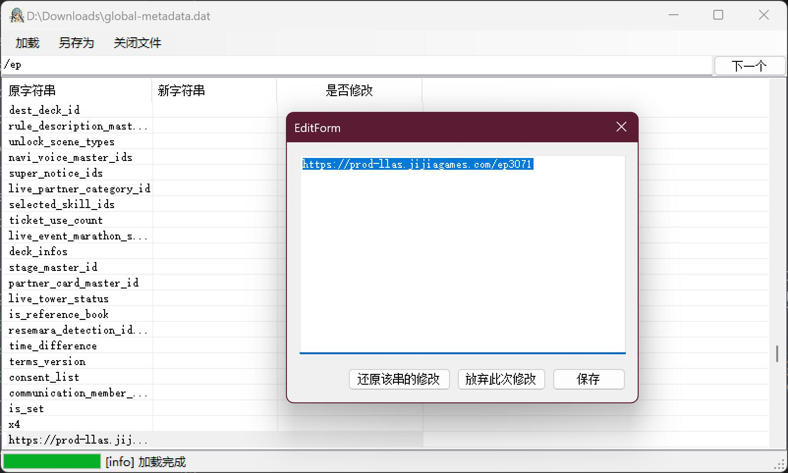
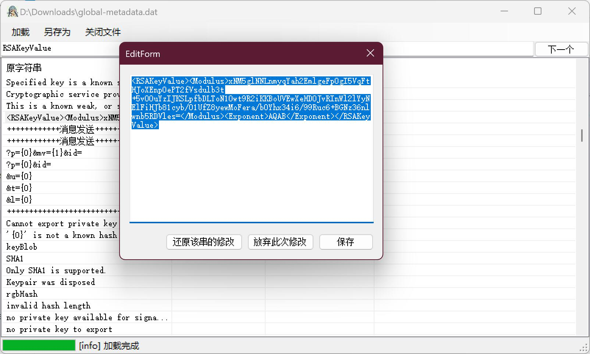
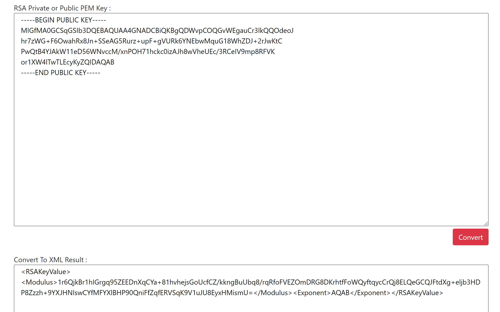

## 其三：AS 客户端修改

AS 客户端修改同样分为 Android 和 iOS 两个平台。

### AS 客户端修改（Android）

Android 客户端修改，分为两个部分：
1. 盛趣相关接口地址的替换
2. 客户端公钥和请求地址的替换

#### 盛趣相关接口地址的替换

参考 [其二：SIF 客户端修改](./2.md) 中的相关部分，完全一样。

#### 客户端公钥和请求地址的替换

由于 AS 使用的是 Unity 引擎，所以相关的信息都存放在 `assets\bin\Data\Managed\Metadata\global-metadata.dat` 中，在上述步骤 Apktool 解包后的目录下找到该文件，使用 [MetaDataStringEditor](https://github.com/JeremieCHN/MetaDataStringEditor) 打开该文件。

在搜索栏里输入 `/ep` 定位到 `https://prod-llas.jijiagames.com/ep3071`，将该地址修改为你的服务器 IP 或者域名。注意如果你的服务器不支持 https，请改成 http。

继续搜索 `RSAKeyValue` 定位到 `<RSAKeyValue><Modulus>...</Modulus><Exponent>AQAB</Exponent></RSAKeyValue>`。此处为客户端通信所使用的公钥，格式为 XML，我们本地生成的 base64 需要经过转换后方可使用。

打开 [RSAKeyConverter](https://raskeyconverter.azurewebsites.net/PemToXml) 网站，将 base64 格式的公钥复制粘贴进去，转换成 XML 格式后，替换上面搜索出来的值。

最后点击另存为，保存为新的文件。替换 `assets\bin\Data\Managed\Metadata\global-metadata.dat` 后重新打包并签名即可。详细打包签名过程参考 [其二：SIF 客户端修改](./2.md) 中的相关部分。

### AS 客户端修改（iOS）

iOS 客户端修改，分为两个部分：
1. 盛趣相关接口地址的替换
2. 客户端公钥和请求地址的替换

#### 盛趣相关接口地址的替换

参考 [其二：SIF 客户端修改](./2.md) 中的相关部分，完全一样。

#### 客户端公钥和请求地址的替换

参考上文 Android 修改方式，完全一样。`global-metadata.dat` 在 `Payload\llas.app\Data\Managed\Metadata` 目录下，修改替换完，重新打包签名即可。详细打包签名过程参考 [其二：SIF 客户端修改](./2.md) 中的相关部分。
